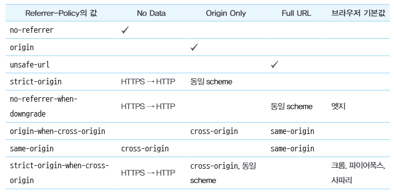

## 14.1. 리액트에서 발생하는 크로스 사이트 스크립팅(XSS)

- **크로스 사이트 스크립팅(Cross-Site Scripting, XSS)**  
  웹사이트 개발자가 아닌 제3자가 웹사이트에 악성 스크립트를 삽입해 실행할 수 있는 취약점

리액트에서는 다음과 같이 XSS 이슈가 발생할 수 있음

### 14.1.1. dangerouslySetInnerHTML prop

`dangerouslySetInnerHTML`은 DOM의 innerHTML을 특정한 내용으로 교체할 수 있는 방법으로, 게시판과 같이 입력 내용을 브라우저에 표시하는 용도로 사용됨.

### 14.1.2. useRef를 활용한 직접 삽입

`useRef`로 직접 DOM에 접근 가능해 innerHTML에 보안 취약점이 있는 스크립트를 삽입하면 문제가 발생할 수 있음.

### 14.1.3. 리액트에서 XSS 문제를 피하는 방법

가장 확실한 방법은 제3자가 삽입할 수 있는 HTML을 안전한 HTML 코드로 치환하는 것. 이를 새니타이즈(sanitize) 또는 이스케이프(escape)라 하는데, 다음과 같은 라이브러리를 통해 사용할 수 있다.

- [DOMpurity](https://github.com/cure53/DOMPurify)
- [sanitize-html](https://github.com/apostrophecms/sanitize-html)
- [js-xss](https://github.com/leizongmin/js-xss)

## 14.2. getServerSideProps와 서버 컴포넌트를 주의하자

서버에는 일반 사용자에게 노출되면 안 되는 정보들이 있어 브라우저에 정보를 내려줄 때 주의해야 함.  
`getServerSideProps`가 반환하는 props 값은 모두 HTML에 기록되고, 전역 변수로 등록되어 스크립트로 접근할 수 있는 보안 위협에 노출되는 값이 됨.  
따라서 `getServerSideProps`가 반환하는 값 또는 서버 컴포넌트가 클라이언트 컴포넌트에 반환하는 props는 반드시 필요한 값으로 철저하게 제한해야 함.

## 14.3. `<a>`태그의 값에 적절한 제한을 둬야 한다

`<a>`태그의 href에 javascript:로 시작하는 코드를 넣으면, URL로 이동하는 것을 막고 별도 이벤트 핸들러만 작동시키기 위한 용도로 사용할 수 있음.  
페이지 이동 없이 핸들러만 작동시키고 싶다면 `<a>`보다는 `button`을 사용할 것.

## 14.4. HTTP 보안 헤더 설정하기

HTTP 보안 헤더란 브라우저가 렌더링하는 내용과 관련된 보안 취약점을 방지하기 위해 브라우저와 함께 작동하는 헤더

### 14.4.1. Strict-Transport-Security

Strict-Transport-Security 응답 헤더는 모든 사이트가 HTTPS를 통해 접근해야 하며, HTTP로 접근하는 경우 HTTPS로 변경되게 함.

```
Strict-Transport-Security: max-age=<expire-time>; includeSubDomains
```

### 14.4.2. X-XSS-Protection

비표준 기술로 사파리와 구형 브라우저에서만 제공하는 기능.  
페이지에서 XSS 취약점이 발견되면 페이지 로딩을 중단하는 헤더. Content-Security-Policy를 지원하지 않는 구형 브라우저에서는 사용 가능하며, 반드시 별도로 XSS 처리를 하는 것이 좋음.

### 14.4.3. X-Frame-Options

페이지를 frame, iframe, embed, object 내부에서 렌더링을 허용할지를 나타낼 수 있음.  
외부에서 자신의 페이지를 위와 같은 방식으로 삽입되는 것을 막아주는 헤더.

```
X-Frame-Options: DENY // 무조건 불가
X-Frame-Options: SAMEORIGIN // 같은 origin은 허용
```

### 14.4.4. Permissions-Policy

웹사이트에서 사용할 수 있는 기능과 없는 기능을 명시적으로 선언하는 헤더. 여기서의 기능은 카메라나 GPS와 같이 브라우저가 제공하는 기능.  
[제어 가능한 기능 목록 MDN 문서](https://developer.mozilla.org/en-US/docs/Web/HTTP/Guides/Permissions_Policy#browser_compatibility)  
[기능 선택해서 헤더 만드는 사이트](https://www.permissionspolicy.com/)

### 14.4.5. X-Content-Type-Options

Content-type 헤더에서 제공하는 MIME 유형이 브라우저에 의해 임의로 변경되지 않게 하는 헤더. 웹서버가 브라우저에 의해 강제로 파일을 읽는 방식을 지정하는 기능.  
공격자가 실제로 이미지가 아니고 스크립트 정보를 담은 .jpg 파일을 업로드하면 브라우저가 해당 코드를 실행할 수도 있음.  
이 때, 다음과 같이 헤더를 설정해 파일의 타입이 CSS나 MIME이 text/css가 아닌 경우, 혹은 파일 내용이 script나 MIME 타입이 자바스크립트 타입이 아니면 차단함.

```
X-Content-Type-Options: nosniff
```

### 14.4.6. Referrer-Policy

HTTP 요청의 Referer 헤더에는 현재 요청을 보낸 페이지의 주소가 나타남. 사용자 입장에서 원치 않는 정보가 노출될 위험이 있는데, Referrer-Policy 헤더는 Referer 헤더에서 사용할 수 있는 데이터를 나타냄.

scheme, hostname, port의 조합을 출처라고 하는데, 두 주소를 비교해 same-origin인지 cross-origin인지 구분한다.

- Referrer-Policy 값에 따른 작동
  

### 14.4.7. Content-Security-Policy

콘텐츠 보안 정책(CSP)은 XSS 공격이나 데이터 삽입 공격과 같은 보안 위협을 막기 위해 설계됨. [사용 가능한 지시문](https://www.w3.org/TR/CSP2/#directives)

**\*-src**  
font-src, img-src, script-src 등 다양한 src를 제어할 수 있는 지시문으로 선언된 소스만 가져올 수 있으며, 이 외의 소스는 모두 차단됨. default-src로 한 번에 처리할 수도 있음.

**form-action**  
폼 양식으로 제출할 수 있는 URL을 제한할 수 있음. form-action 자체를 모두 막는 것도 가능하다.

### 14.4.9. 보안 헤더 확인하기

[보안 헤더 현황 알려주는 사이트](https://securityheaders.com/)

## 14.5. 취약점이 있는 패키지의 사용을 피하자

[https://security.snyk.io/](https://security.snyk.io/)를 통해 현재 라이브러리의 취약점을 파악하고 패키지 보안 이슈를 추적할 수 있음.

## 14.6. OWASP Top 10

Open Worldwide (Web) Application Security Project라는 오픈소스 웹 애플리케이션 보안 프로젝트로, 주로 웹에서 발생할 수 있는 정보 노출, 악성 스크립트, 보안 취약점 등을 연구해 공개하는 10대 웹 애플리케이션 취약점.

곧 OWASP Top Ten 2025가 발표될 예정이라고 함. [OWASP 사이트](https://owasp.org/www-project-top-ten/)
